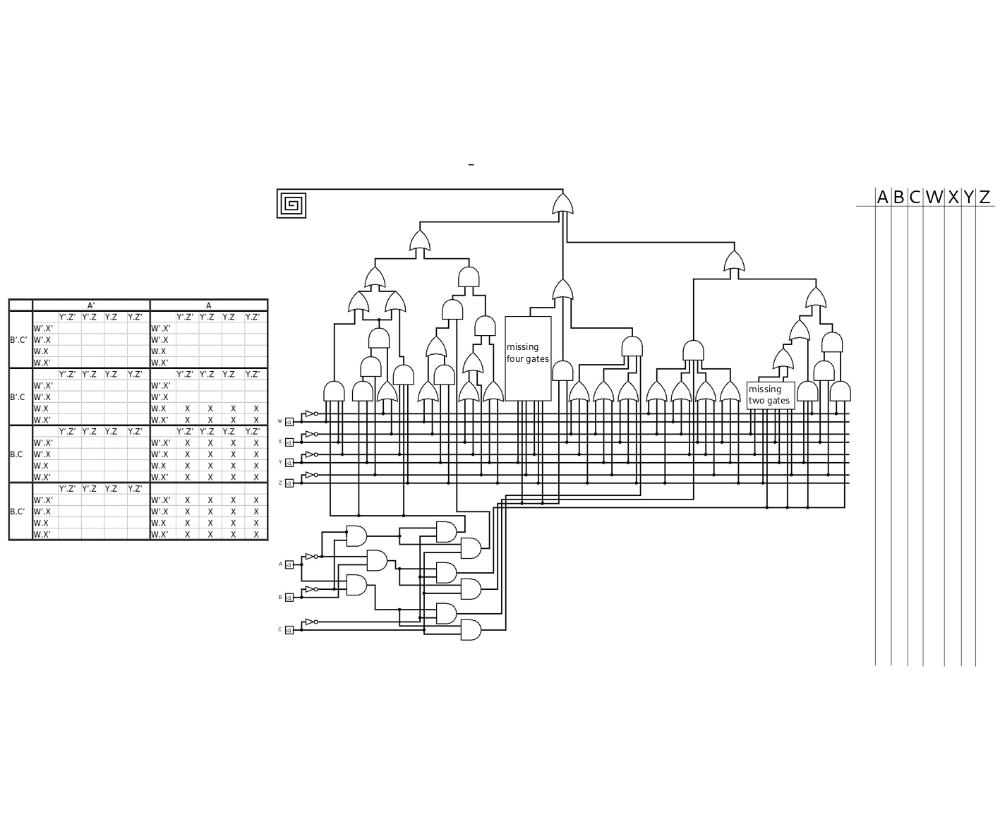

# WPICTF2019 - coffeegate

## Challenge

Type: hardware, misc, logic gates

Danny the intern spilled coffee on my circuit! Can you help me recover my work?

Flag is in the format `flag{...}`. Submit it in the format `WPI{...}`.

made by John Faria
2:128

## Solution

The image contains a logic circuit with a few missing gates.

On the picture there is a karnaugh map. If we examine the circuit, we can see that the missing gates are connected to the output only via XOR gates which means that we can create the k-map without the missing gates, but we have to remember that there will be a few cases where zeroes could be ones due to the missing gates.

So basically that's what we did. We started off by creating the circuit without the missing gates in Logisim and filled the k-map by generating all the possible inputs. We have 7 inputs, `WXYZ` and `ABC`. We assumed that the order is `ABCWXYZ` (as A is the MSB and Z is the LSB) since there is a table on the right part of the image.

If we start to read the numbers from the k-map (in the right order of course) and turn it into ascii we can get the flag part, but after that it's just messed up because of the missing gates.

One thing to note, is that we have a bunch of don't cares at the end of the k-map, so we know that the output is 11 character long, and it is in the format of flag{...}

### The missing two gates

For the `missing two gates` we can assume that the left 4 and right 4 wires are connected into the same gate, since the other 4 input gates has the same layout in the image. The left gate has the following inputs: `X', Y', Z, A'*B*C'` and the right gate has: `X, Y, Z', A'*B*C'` wires connected as input. This localizes the bits in the k-map that can change from zero to one if the output of any of these gates are true. From here we can just simply try all four combinations for the gates and check the modified k-map. It turns out, with two AND gates, we get the `flag{B` output from the k-map which looks promising.

### The missing four gates

Since we can see both AND and OR gates with 3 inputs on the circuit, we can tell that the wires will go into two AND gates, but what are the remaining gates? We could create a XOR gate from 4 gates, but that would require a different wiring at the bottom. At this point we got stuck a bit. After taking a break we've realized, that since the inputs are given (`Y, Z', A'*B*C` and `Y', Z, A'*B*C`) for the missing gates, we could just check what would be the output by changing the affected bits, and boom. We found the flag{Booley output. Upon further checking, we saw that there is only 1 bit difference between the `y` and `}` characters, and we knew that the flag is in the `flag{}` format, thus we modified the `y` to `}`. (As it turned out, there was a small error in the circuit that resulted in this error.)

The last step was to convert the `flag{Boole}` to `WPI{Boole}` as said in the challenge description.

## Other write-ups

writeups: 
- <https://ctftime.org/task/8242>
- <https://wiki.armiaprezesa.pl/books/wpictf2019/page/coffeegate>