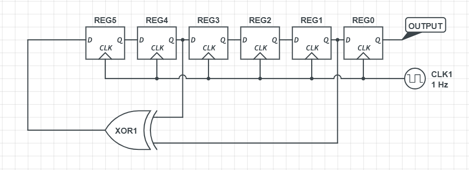

# WPICTF2019 - Shifty

## Challenge

Type: hardware, misc, shift register

Seed: `6'b111111` Hint: `{0xbc, 0x1c, 0x56, 0x06, 0xab, 0xb5, 0x61, 0xa0, 0xe2, 0x8b, 0x55, 0xed, 0x74, 0xdd, 0x2f, 0x60}`

made by Ed Krawczyk.



## Solution

The hint contains 16 bytes. All we had to do, is to generate 16x8 bits with the shift register, and XOR the generated bits in reverse order with the hint. So for example if the shift register gives the following output `[0]: a, [1]: b, [2]: c, [3]: d7` we shall xor with the hint in `d,c,b,a` order. 

After the XOR, we get the following string: `_i_am_soo_proud_`

The flag is the string without the leading and eding _ character: `WPI{i_am_soo_proud}`

The script that we used:

```python
import binascii

def clk(time):
    output = ""
    registers = [1, 1, 1, 1, 1, 1]
    for t in range(time):
        newregisters = [0, 0, 0, 0, 0, 0]
        newregisters[0] = registers[1]
        newregisters[1] = registers[2]
        newregisters[2] = registers[3]
        newregisters[3] = registers[4]
        newregisters[4] = registers[5]
        newregisters[5] = (registers[4] + registers[1]) % 2
        output += str(registers[0])
        for i in range(6):
            registers[i] = newregisters[i]
    return output

def int2bytes(i):
    hex_string = '%x' % i
    n = len(hex_string)
    return binascii.unhexlify(hex_string.zfill(n + (n & 1)))

hint = "10111100000111000101011000000110101010111011010101100001101000001110001010001011010101011110110101110100110111010010111101100000"
output = clk(8*16)
flag_int = int(hint, 2) ^ int(output[::-1], 2)
#print "{0:b}".format(flag_int)
print int2bytes(flag_int).decode('utf-8')
```

## Other write-ups

writeups: 
- <https://ctftime.org/event/728/tasks/>
- <https://github.com/zst-ctf/wpictf-2019-writeups/tree/master/Solved/Shifty_Boi>