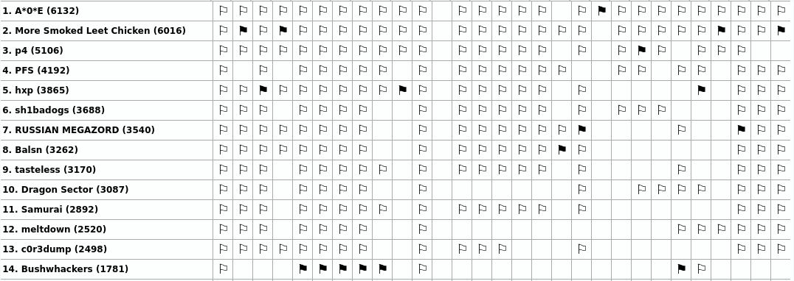

# CTFs in 2020

## SpamAndFlags

+ [SpamAndFlags](SpamAndFlags)
    * [Environmental Issues](SpamAndFlags/environmental-issues)
    * [Git the Flag](SpamAndFlags/git-the-flag)
    * [Hashing@Home](SpamAndFlags/hashing@home)
    * [OTS](SpamAndFlags/ots)
    * [Pwnzi](SpamAndFlags/pwnzi)
    * [Shor](SpamAndFlags/shor)
    * [TAS](SpamAndFlags/tas)
    * [The 3D Printer Task](SpamAndFlags/the-3d-printer-task)

The team finished on the `13th` place with `2498` points.

## Links
- <https://twitter.com/c0r3dumpCTF>
- <https://ctftime.org/team/65521>
- <https://crysys.hu>
- <https://twitter.com/CrySySLab>