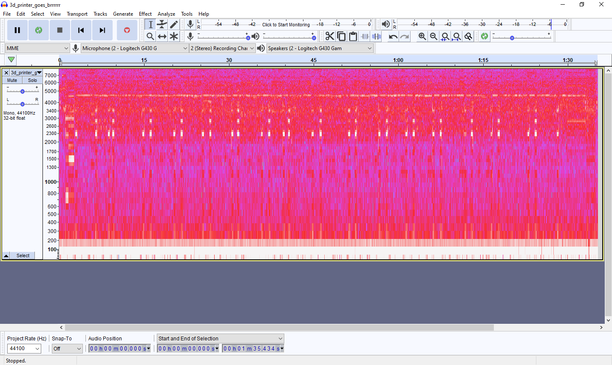
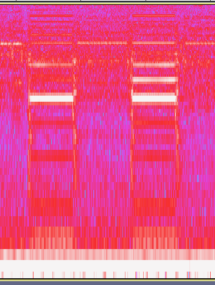
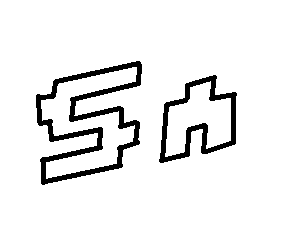
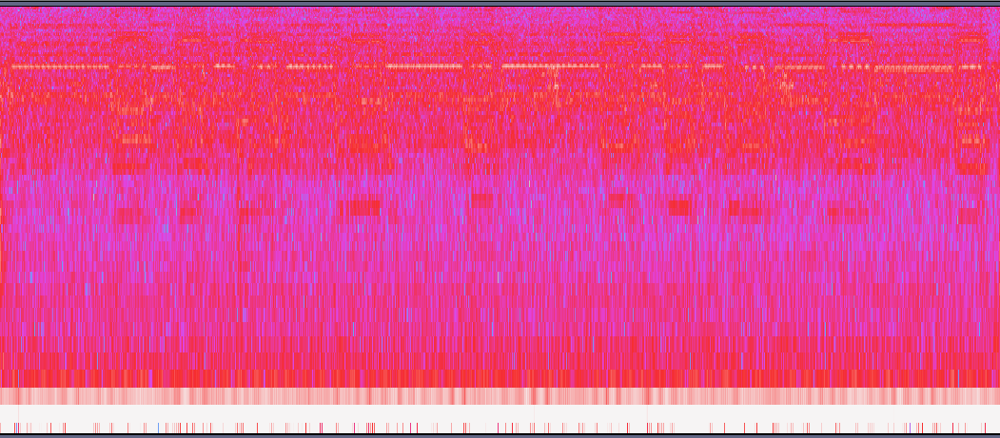
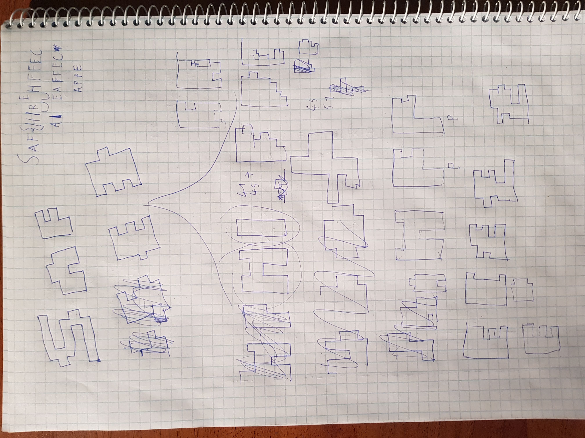
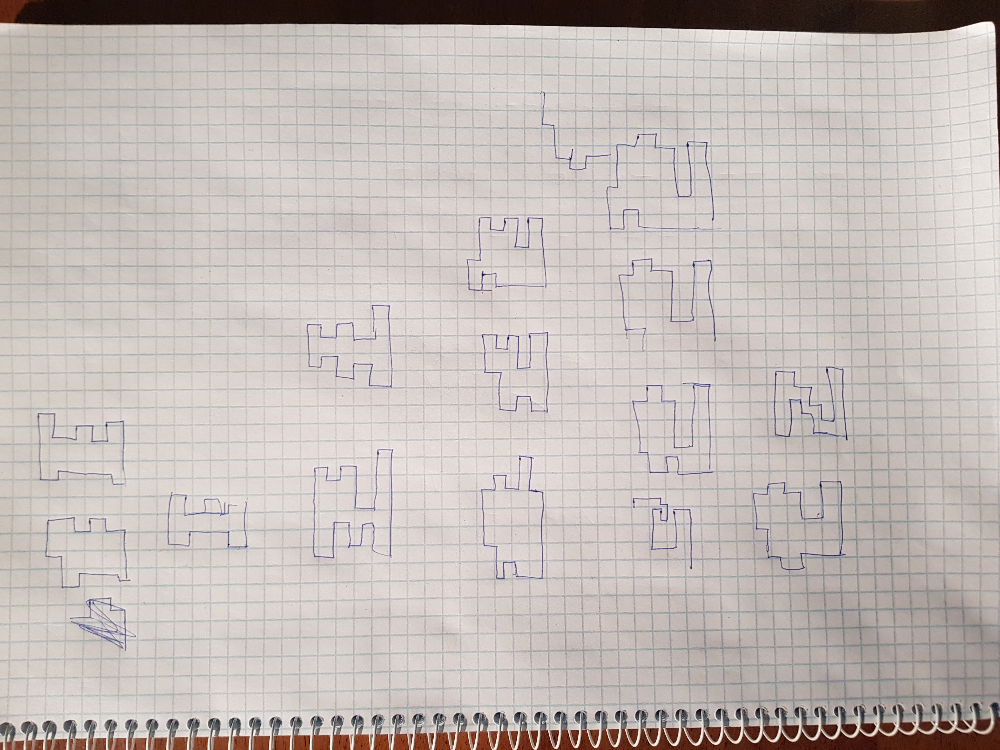

# SpamAndFlags 2020 - The 3D Printer Task

## Challenge

We have 3D printed a great object, and wanted to show you... unfortunately we only have the [video file of the print](3d_printer_goes_brrrrrr.mkv)... and it's corrupted.

But they say when you have 3d printed enough, you don't even hear the sounds. All you hear is blonde, brunette, redhead.

264 points

## Solution

After watching the video it is clear that we have to reconstruct the movement of the printer from the sounds and spell out the flag. 

First, I've converted the video file to a .wav sound file and loaded up Audacity.

Changed the view to the spectrogram view and started to examine the characteristics.

The character separators can easily be identified by the double "local earthquakes".

Then also tried to find the font used in the video to help identify the letters. For this I've sketched up the first few letters and run them through some online font recognizers (https://www.myfonts.com/WhatTheFont/).

I could not find the exact one that can be seen on the video, but [this](https://www.fonts.com/font/linotype/lomo/wall-outline-55) is the closest I could get, and it still helped me a lot.

And my last weapon of choice was an online [crossword solver](https://www.crosswordsolver.org/) to help fill in the harder letters.

With all this information I finally started to solve the letters one by one.

The methodology in short is that every letter starts with a horizontal line at the bottom, and that the sounds that represent the horizontal and vertical lines alternate, the odds being the horizontal and the even being the vertical ones. The length of the sound is also important, because it is an estimate on the length of the line. The last trick was to find symmetry between the sounds to help better identify the letters.

The first three letters, which can be seen in the video helped me get the hang of it and then after a lot of trial and error I could narrow it down to only a few possibilities. After a bit of googling one of the possibilities stand out, which was `SAF{AIRGAPPED?}` the `?` being the only unidentified letter, and from there it was just a matter of time till I've realized it's in fact not a letter, but a number.

The flag is `SAF{AIRGAPPED2}`.

## Other write-ups

- <https://ctftime.org/task/11521>
