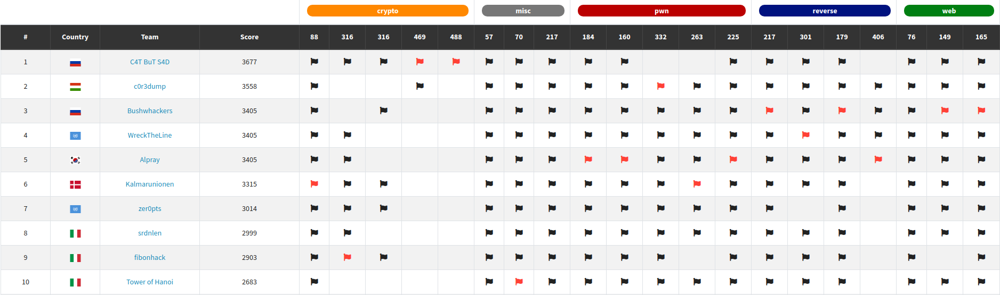

# CTFs in 2021

## m0leCon 2021 CTF Teaser

### Results

We achieved **2nd** place at [m0leCon Teaser CTF](https://ctf.m0lecon.it/scoreboard)!

### Challenges

* [babysign](m0leConTeaser/babysign)
* [Obscurity-fixed](m0leConTeaser/Obscurity-fixed)
* [Proof-of-Work](m0leConTeaser/Proof-of-Work)
* [Key-Lottery](m0leConTeaser/Key-Lottery)
* [Left or right](m0leConTeaser/Left%20or%20right)
* [Little-Alchemy](m0leConTeaser/Little-Alchemy)
* [Another Login](m0leConTeaser/Another%20Login)
* [Puncher](m0leConTeaser/Puncher)
* [Donut Factory](m0leConTeaser/Donut%20Factory)
* [Yet Another Login](m0leConTeaser/Yet%20Another%20Login)
* [Automatic Rejection Machine](m0leConTeaser/Automatic%20Rejection%20Machine)
* [parallel-the-m0le](m0leConTeaser/parallel-the-m0le)
* [PeTaMorphosis](m0leConTeaser/PeTaMorphosis)
* [m0lang](m0leConTeaser/m0lang)
* [Lucky-Fall](m0leConTeaser/Lucky-Fall)
* [m0lefans](m0leConTeaser/m0lefans)
* [Waffle](m0leConTeaser/Waffle)

## Links

- <https://twitter.com/c0r3dumpCTF>
- <https://ctftime.org/team/65521>
- <https://crysys.hu>
- <https://twitter.com/CrySySLab>