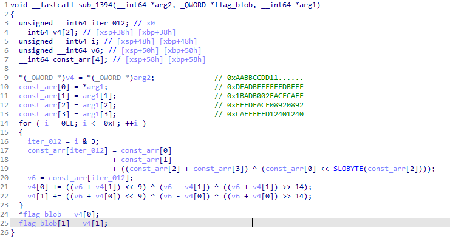
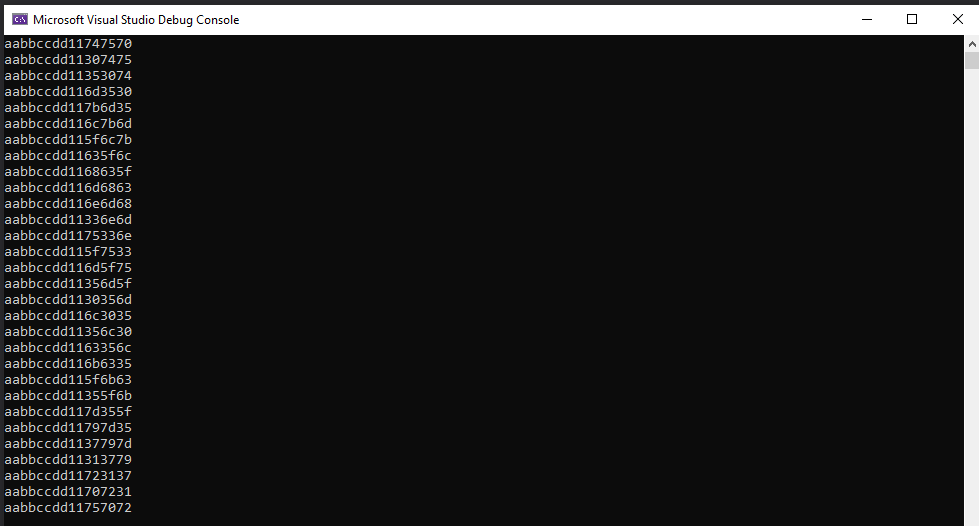

# m0leCon 2021 CTF Teaser - Automatic Rejection Machine

## Challenge

I'm sorry, your flag is rejected.

[challenge](challenge)

### Metadata

- Tags: `reverse`
- Author: *mr96*
- Points: 217
- Solves: 19

## Solution

In main there is a function that shuffles our input at baked-in indexes that we can extract from the binary. This list is:

```python
swapbox = [0, 2, 11, 6, 4, 5, 3, 7, 8, 9, 10, 1, 12, 22, 24, 15, 17, 16, 18, 19, 23, 20, 13, 21, 14, 29, 28, 27, 26, 25]
```

Next it appends the first two characters of the input to the end and calls the  `HideBytes` function. This function creates 8-byte values by OR-ing 3 bytes of our input with a constant.

`0xAABBCCDD11{input[i + 2]}{input[i + 1]}{input[i + 0]}`

Afterwards it calls the `CreateChunks` function which performs various operations on the input and outputs two chunks at a time. At the end of the program these are then compared to existing data in the binary to check if our input was correct.

```python
correct_chunks = [0xB4D8846071AC9EE5, 0x1E1FF00814E134FE, 0x6B198E7941B7002E, 0xBC6FA839EFE36443, 0xC3C71AD9A664B6C3, 0x5692A2F09C98D986, 0xF084A1A59CD01E68, 0xBC52E78A7E4DF2DF, 0xDA219D93290B91A8, 0x5703D0286FA5D32F, 0x6274B1B118DA82B2, 0xA746EBFB0954EBBC, 0x5F6DF7BD4F1967A2, 0x16D5B5BDEE98CF8E, 0x52E8B6DF7E62E39A, 0x99F9455FB0C8D933, 0x05FFD82D53AF933D, 0xFF9084A16FF0141C, 0xE17C5F0781D52F9B, 0x1A0F4431548E51D1, 0xF2E8573D8F0F01DD, 0x250039177F4DEF91, 0x8851491ECBC7AF7C, 0xAD427C6695B91D24, 0x5E0071D97D98D094, 0x264DDA52B0C37B03, 0xA5811271D6D7C428, 0xE0133FC719F34136, 0xE508ACE2412B2633, 0x74321A3E9FACE34C, 0xFF5B8A59E8EBF70B, 0x76275A516F88C986, 0x1604D76F74599CC4, 0xF744BCD8F2016F58, 0xA0B6A7A0239E4EA7, 0xF1EFC57F15CB9AB4, 0xB0D1AD4FB4ED946A, 0x81CA31324D48E689, 0xE6A9979C51869F49, 0xA666637EE4BC2457, 0x6475B6AB4884B93C, 0x5C033B1207DA898F, 0xB66DC7E0DEC3443E, 0xE4899C99CFA0235C, 0x3B7FD8D4D0DCAF6B, 0xB1A4690DB34A7A7C, 0x8041D2607129ADAB, 0xA6A1294A99894F1A, 0xDDE37A1C4524B831, 0x3BC8D81DE355B65C, 0x6C61AB15A63AD91E, 0x8FA4E37F4A3C7A39, 0x268B598404E773AF, 0x74F4F040AE13F867, 0x4DF78E91FD682404, 0xABE1FC425A9A671A, 0x1BB06615C8A31DD5, 0x9F56E9AEF2FA5D55, 0x239DCF030B3CE09B, 0x24556A34B61CA998]
```



Using the previously extracted values we can reverse the algorithm and turn the correct chunks back into their starting forms.

Python did not work correctly because of it's arbitrary-length integers so I chose to write a C++ program instead to do the job.

```c++
#include <stdint.h>
#include <iostream>

int main()
{
	// values of v6 can be precalculated from the constants in the binary
    uint64_t v6_arr[] = { 0x2cae7100db2aa4bf, 0x564bb6155e278a8f, 0x90e9bc27c1804a20, 0x03bc46c20d128bae, 0xd286cd6d07e5051c, 0xbc158b78349f6579, 0x21df60db0b174063, 0xa94fe86254ae36a6, 0x82a3bac29c49e19e, 0x68198c0830aebe20, 0x141d8c982cbe16c7, 0xd76d5c7f7295222b, 0xa514cf24889c97b0, 0x6f1bd6808a6436c2, 0x761e20f8e419af64, 0xd872ac1d69afa001 };
    uint64_t blobs[][2] = { {0xB4D8846071AC9EE5, 0x1E1FF00814E134FE}, {0x6B198E7941B7002E, 0xBC6FA839EFE36443}, {0xC3C71AD9A664B6C3, 0x5692A2F09C98D986}, {0xF084A1A59CD01E68, 0xBC52E78A7E4DF2DF}, {0xDA219D93290B91A8, 0x5703D0286FA5D32F}, {0x6274B1B118DA82B2, 0xA746EBFB0954EBBC}, {0x5F6DF7BD4F1967A2, 0x16D5B5BDEE98CF8E}, {0x52E8B6DF7E62E39A, 0x99F9455FB0C8D933}, {0x05FFD82D53AF933D, 0xFF9084A16FF0141C}, {0xE17C5F0781D52F9B, 0x1A0F4431548E51D1}, {0xF2E8573D8F0F01DD, 0x250039177F4DEF91}, {0x8851491ECBC7AF7C, 0xAD427C6695B91D24}, {0x5E0071D97D98D094, 0x264DDA52B0C37B03}, {0xA5811271D6D7C428, 0xE0133FC719F34136}, {0xE508ACE2412B2633, 0x74321A3E9FACE34C}, {0xFF5B8A59E8EBF70B, 0x76275A516F88C986}, {0x1604D76F74599CC4, 0xF744BCD8F2016F58}, {0xA0B6A7A0239E4EA7, 0xF1EFC57F15CB9AB4}, {0xB0D1AD4FB4ED946A, 0x81CA31324D48E689}, {0xE6A9979C51869F49, 0xA666637EE4BC2457}, {0x6475B6AB4884B93C, 0x5C033B1207DA898F}, {0xB66DC7E0DEC3443E, 0xE4899C99CFA0235C}, {0x3B7FD8D4D0DCAF6B, 0xB1A4690DB34A7A7C}, {0x8041D2607129ADAB, 0xA6A1294A99894F1A}, {0xDDE37A1C4524B831, 0x3BC8D81DE355B65C}, {0x6C61AB15A63AD91E, 0x8FA4E37F4A3C7A39}, {0x268B598404E773AF, 0x74F4F040AE13F867}, {0x4DF78E91FD682404, 0xABE1FC425A9A671A}, {0x1BB06615C8A31DD5, 0x9F56E9AEF2FA5D55}, {0x239DCF030B3CE09B, 0x24556A34B61CA998} };
    uint64_t v4[] = { 0,0 };

    std::cout << std::hex;

    for (uint8_t i = 0; i < sizeof(blobs) / 16; i++) {
        v4[0] = blobs[i][0];
        v4[1] = blobs[i][1];
        for (int8_t j = (sizeof(v6_arr) / 8) - 1; j >= 0; --j) {
            v4[1] = v4[1] - (((v6_arr[j] + v4[0]) << 9) ^ (v6_arr[j] - v4[0]) ^ ((v6_arr[j] + v4[0]) >> 14));
            v4[0] = v4[0] - (((v6_arr[j] + v4[1]) << 9) ^ (v6_arr[j] - v4[1]) ^ ((v6_arr[j] + v4[1]) >> 14));
        }
        printf("%I64x\n", v4[0]);
    }
    return 0;
}
```



Finally I can use the output and reverse the first two layers to get the flag.

```python
cpp_output = ("aabbccdd11747570","aabbccdd11307475","aabbccdd11353074","aabbccdd116d3530","aabbccdd117b6d35","aabbccdd116c7b6d","aabbccdd115f6c7b","aabbccdd11635f6c","aabbccdd1168635f","aabbccdd116d6863","aabbccdd116e6d68","aabbccdd11336e6d","aabbccdd1175336e","aabbccdd115f7533","aabbccdd116d5f75","aabbccdd11356d5f","aabbccdd1130356d","aabbccdd116c3035","aabbccdd11356c30","aabbccdd1163356c","aabbccdd116b6335","aabbccdd115f6b63","aabbccdd11355f6b","aabbccdd117d355f","aabbccdd11797d35","aabbccdd1137797d","aabbccdd11313779","aabbccdd11723137","aabbccdd11707231","aabbccdd11757072")
res = []
for stri in cpp_output: # extract the flag's characters
	res += (chr(int(stri[-2:], 16)))

swapbox = [0, 2, 11, 6, 4, 5, 3, 7, 8, 9, 10, 1, 12, 22, 24, 15, 17, 16, 18, 19, 23, 20, 13, 21, 14, 29, 28, 27, 26, 25]
for i in range(30): # assemble the flag in the correct order and print it
	print(res[swapbox[i]], end='')
```

The flag is `ptm{5m0l_chunk5_5m0l_53cur17y}`.