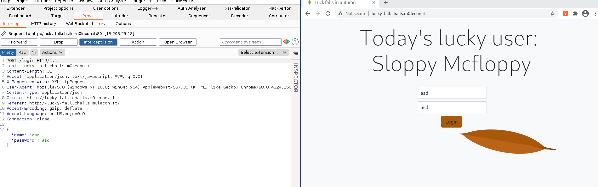
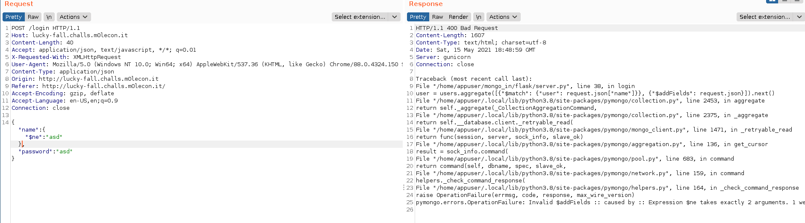
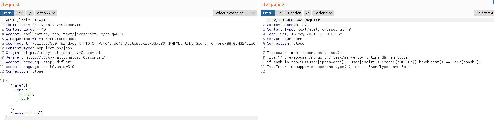
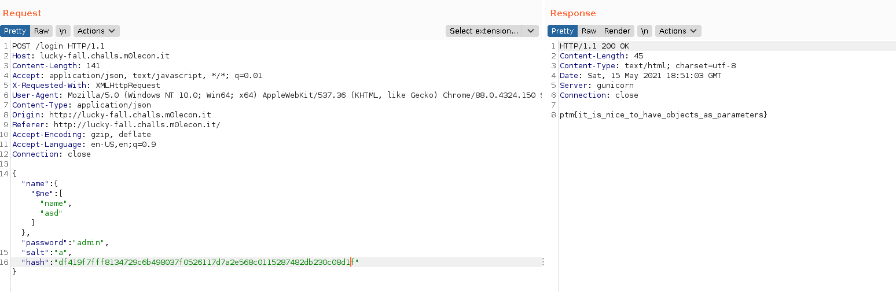

# m0leCon 2021 CTF Teaser - Lucky-Fall

## Challenge

Are you a [lucky user](http://lucky-fall.challs.m0lecon.it/)?

### Metadata

- Tags: `web`, `warmup`
- Author: *0000matteo0000*
- Points: 76
- Solves: 95

## Solution

I opened the website in Burp, and the following login form greets us.



My first guess was some kind of injection attack, therefore I saved the request to a file named `login` and gave it a go with `sqlmap`, using the command `sqlmap -r login --level=5 --risk=3`.

While it was running I manually tried NoSQL injections, which turned out successful.



As the error message suggests, `$ne` excepts two arguments, therefore I needed to modify the request to

```json
{
    "name": {
        "$ne": ["name", "asd"]
    },
    "password": "asd"
}
```

There were no error messages, therefore I thought thats it, I did the same with the `password` parameter, and it threw an error. I fuzzed there a bit manually, and when I gave `null` to password, the application returned the following error.



Since I knew the password generation algorithm and thanks to the `{"$addFields": request.json}` part of the source code, the application extracts everything from my request. Therefore all I needed to do was to supply the backend with the required parameters. The following request returned the flag.



The flag is `ptm{it_is_nice_to_have_objects_as_parameters}`.