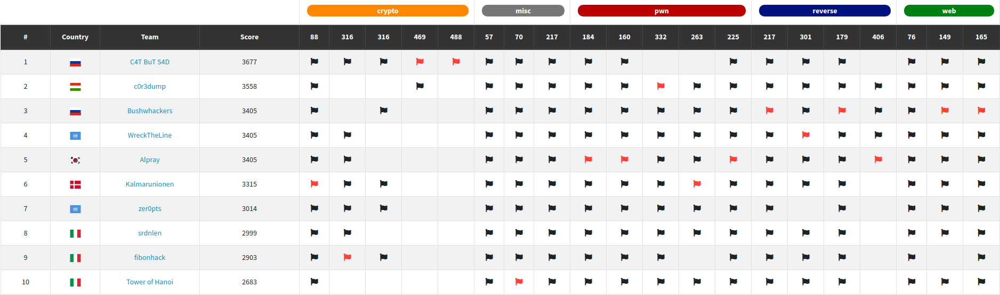

# m0leCon 2021 CTF Teaser

## Results

We achieved **2nd** place at [m0leCon Teaser CTF](https://ctf.m0lecon.it/scoreboard)!

## Challenges

* [babysign](babysign)
* [Obscurity-fixed](Obscurity-fixed)
* [Proof-of-Work](Proof-of-Work)
* [Key-Lottery](Key-Lottery)
* [Left or right?](Left%20or%20right?)
* [Little-Alchemy](Little-Alchemy)
* [Another Login](Another%20Login)
* [Puncher](Puncher)
* [Donut Factory](Donut%20Factory)
* [Yet Another Login](Yet%20Another%20Login)
* [Automatic Rejection Machine](Automatic%20Rejection%20Machine)
* [parallel-the-m0le](parallel-the-m0le)
* [PeTaMorphosis](PeTaMorphosis)
* [m0lang](m0lang)
* [Lucky-Fall](Lucky-Fall)
* [m0lefans](m0lefans)
* [Waffle](Waffle)

## Links

- <https://twitter.com/c0r3dumpCTF>
- <https://ctftime.org/team/65521>
- <https://crysys.hu>
- <https://twitter.com/CrySySLab>